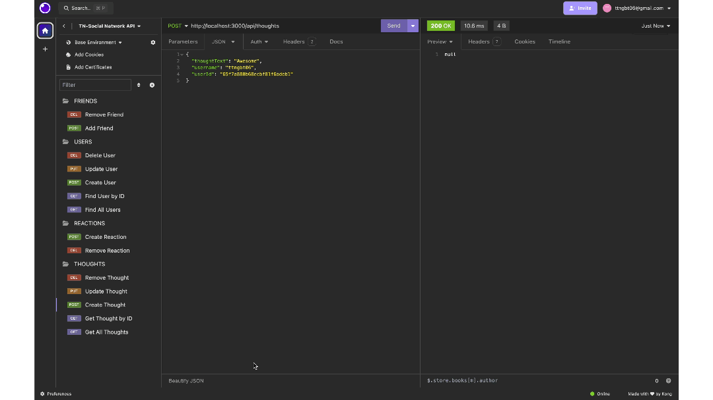

# NoSQL: Social Network API
## Description
This is an API for a social networking site using a NoSQL database which can handle large amounts of unstructured data. The user can start the server and use Insomnia to:

* View all users and view users by ID.
* Add users to the database, update their info and delete users.
* Add thoughts associated to users, as well as update the thought and delete the thoughts. 
* Add reactions associated to the thoughts and a user or delete the reactions.

## Installation
Clone this respository. Then install **[MongoDB](https://www.mongodb.com/)** to store data and **[Insomnia](https://insomnia.rest/)** to test the routes.

## Usage
Watch and follow this **[Video](https://app.screencastify.com/v3/watch/ktkAlUA1JPMuErsyncXF)** for usage instruction.

